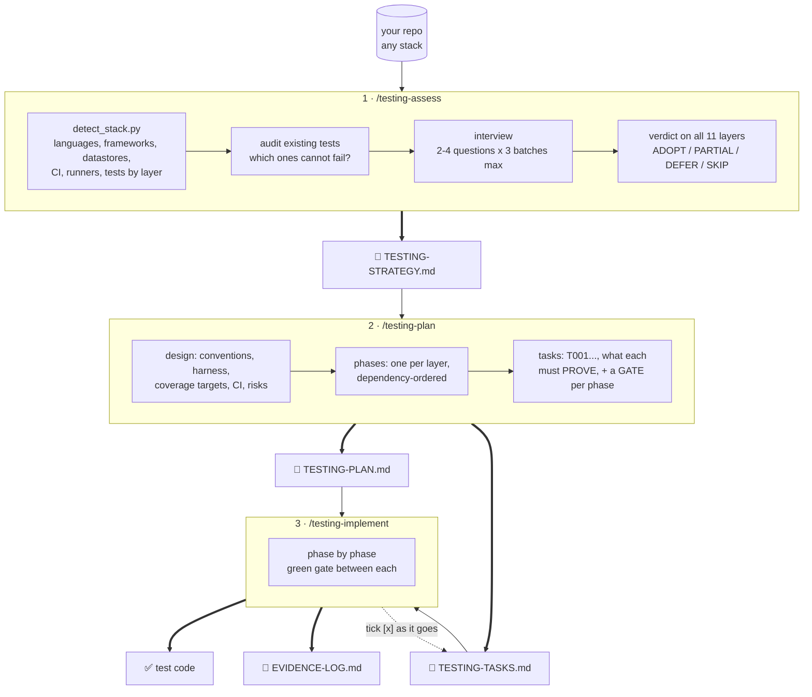
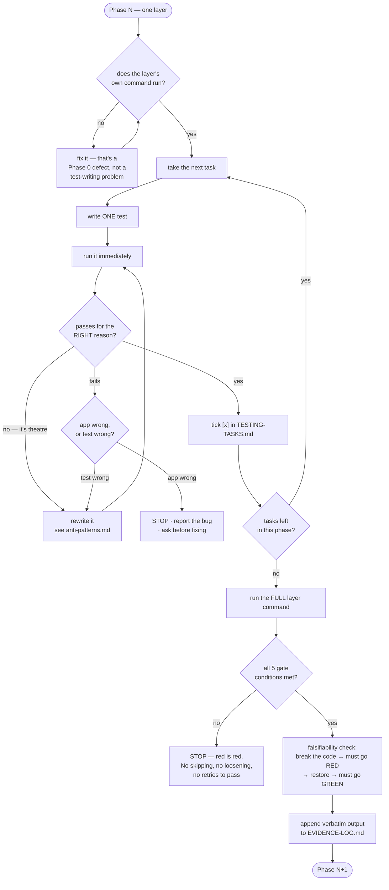

# testing-coverage

Three commands that turn *"we should add tests"* into a designed, layered,
verifiable test suite — in any language or framework.

```
/testing-assess      →  docs/testing/TESTING-STRATEGY.md
/testing-plan        →  docs/testing/TESTING-PLAN.md + TESTING-TASKS.md
/testing-implement   →  test code + EVIDENCE-LOG.md
```

---

## Install

```bash
git clone https://github.com/rakymat-plugins/testing-coverage.git
cd testing-coverage
./install.sh
```

That's it. Restart Claude Code and the three commands are available in **every**
project.

### Options

| Command | What it does |
| --- | --- |
| `./install.sh` | install for every project (`~/.claude`) |
| `./install.sh --local` | install for the current project only (`./.claude`) |
| `./install.sh --uninstall` | remove it again (add `--local` to target a project install) |
| `./install.sh --help` | show usage |

Re-run `./install.sh` any time to update — it replaces the previous install
rather than merging, so files deleted upstream don't linger.

### Windows

Run it from **Git Bash** (right-click in the folder → *Git Bash Here*):

```bash
./install.sh
```

From PowerShell or CMD, call Git's bash by full path:

```powershell
& "C:\Program Files\Git\bin\bash.exe" ./install.sh
```

> **Don't** type a bare `bash ./install.sh` in PowerShell. On Windows that
> resolves to `C:\Windows\System32\bash.exe` — the WSL launcher — which fails
> with `execvpe(/bin/bash) failed` unless you have a WSL distro installed.

### What it installs, and where

```
~/.claude/skills/testing-coverage/     SKILL.md, 7 references, 4 templates, 1 script
~/.claude/commands/testing-assess.md
~/.claude/commands/testing-plan.md
~/.claude/commands/testing-implement.md
```

The installer verifies every file landed and exits non-zero if any is missing, so
a partial install can't pass silently.

### Requirements

- **bash** — Git Bash on Windows, built in on macOS/Linux/WSL.
- **Python 3.8+** — *optional.* Powers the stack detector. Without it the
  workflow still runs; stack detection falls back to manual inspection. The
  installer tells you which case you're in and smoke-tests the detector.

Nothing to `pip install` or `npm install`. No API keys.

---

## Why

Most test suites fail in one of four ways, and none of them is fixed by writing
more tests:

- **Coverage theatre** — 90% line coverage from unit tests alone, while nobody has
  ever asserted that login works against a real database.
- **Tests that cannot fail** — constants asserted against themselves, `status !==
  500`, assertions that restate the mock literal. Worse than no test, because they
  convert an unknown into a false assurance.
- **Runs on one laptop** — hardcoded ports, a database someone set up by hand, no
  disposable environment, so the suite quietly dies.
- **No structure** — one `test` script that runs everything, so a red build tells
  you only that *something* broke.

This addresses the cause: **decide which layers the project's risk actually
requires, build them in dependency order, and prove each one green before moving
to the next.**

## Usage

```bash
cd your-project

/testing-assess              # interview + layer decisions
/testing-plan                # plan + phased task list
/testing-implement           # build phase 0, gate it, continue

/testing-implement --phase-only   # one phase per invocation
/testing-assess --quick           # one question batch
/testing-assess --no-questions    # documented assumptions, no interview
```

Plain language works too: *"what tests does this project need"*, *"plan testing for
this repo"*, *"implement the testing plan"*.

The three artifacts are the handoff — a different person, or a fresh session, can
pick up at any stage by reading them.

## The three commands

### 1. `/testing-assess`

Detects the stack, audits any existing tests for honesty, then interviews you like
a senior test engineer would on day one — 2–4 questions at a time, three batches
maximum, drawn from what it actually found in your repo.

Output: a strategy document with a verdict on all eleven layers
(`ADOPT` / `PARTIAL` / `DEFER` / `SKIP`), each with a reason, plus concrete tooling
and a harness design.

A recorded `SKIP` is a professional decision. A layer silently absent is a gap
that surprises someone at 2am. The only difference is that table.

### 2. `/testing-plan`

Turns the strategy into spec-driven artifacts:

- **`TESTING-PLAN.md`** — the design: conventions, harness build-out, phase table
  with exit criteria, coverage targets per area, CI design, risks.
- **`TESTING-TASKS.md`** — the checklist: one phase per layer, sequential task IDs,
  `[P]` markers for parallel-safe work, and a mandatory `GATE` task closing every
  phase.

Tasks state what they must **prove**, not just which file to create.

### 3. `/testing-implement`

Executes it, one phase at a time. For each task: write one test, run it
immediately, confirm it passes for the right reason.

At the end of every phase it enforces a **green gate** — the layer's own command
exits zero, real output is recorded verbatim, zero unexplained skips, and a
**falsifiability check**: deliberately break the code under test, confirm the test
goes red, restore, confirm green. A test never seen failing is not evidence.

It will not weaken an assertion, skip a failing test, or add a retry to reach
green. If your app turns out to have a real bug, it stops and tells you rather
than quietly fixing production code inside a testing task.

## The eleven layers

| | Layer | Proves |
| --- | --- | --- |
| L0 | Static gates | compiles, types, lint, boundaries, no committed secrets |
| L1 | Unit | pure logic, validation, calculations, state transitions |
| L2 | Component | one UI unit renders its states and handles interaction |
| L3 | Contract | producer/consumer shapes agree; generated specs are fresh |
| L4 | Integration | real process + real datastore over the real transport |
| L5 | Authorization | every role × every protected action, incl. anonymous & revoked |
| L6 | End-to-end | a real client completes a real user journey |
| L7 | Non-functional UI | accessibility, zero runtime errors, visual regression, responsive |
| L8 | Resilience | races, idempotency, partial failure, transaction budgets |
| L9 | Load | throughput and latency thresholds under concurrency |
| L10 | Guardrails | drift: silently dropped migrations, regressed config, budgets |

**Almost no project needs all eleven.** Choosing what to skip is the point.

## Any stack

Layer definitions are stack-agnostic; tooling is mapped per ecosystem in
`skills/testing-coverage/references/stack-map.md`, which covers JavaScript/
TypeScript, Python, Go, Ruby, PHP, Java/Kotlin, C#/.NET, Rust, iOS, Android,
Flutter, React Native, data/ETL pipelines, infrastructure-as-code, shell/CLI
tools, and a path for legacy code with no recognizable stack.

Two rules keep it honest everywhere:

1. **Whatever the repo already uses wins.** A Mocha project doesn't get migrated
   to Vitest as a side effect of adding coverage.
2. **One command per layer** — via separate configs, test markers, build tags, or
   directory scoping, whichever the ecosystem prefers.

## What's in here

```
install.sh                     the installer
commands/                      the 3 slash commands
skills/testing-coverage/
  SKILL.md                     the layer model + guardrails
  references/
    layers.md                  what each layer proves, cannot prove, and costs
    stack-map.md               tooling per ecosystem
    interview.md               the question bank, and what each question decides
    harness.md                 disposable services, seeding, auth, determinism, CI
    gates.md                   the green-gate definition and forbidden routes to it
    writing-tests.md           per-layer playbooks: what to assert
    anti-patterns.md           the fake-test catalogue
  templates/                   the 4 output documents
  scripts/detect_stack.py      stack + coverage detector (stdlib only)
```

## The stack detector

Used automatically by `/testing-assess`. Standalone:

```bash
python skills/testing-coverage/scripts/detect_stack.py /path/to/repo
python skills/testing-coverage/scripts/detect_stack.py /path/to/repo --json
```

Python 3 standard library only. Reports languages, package managers, frameworks,
datastores, external services, container and CI setup, test runners, existing test
files bucketed by layer guess, and which core layers have no coverage at all.

Layer counts are **path heuristics**. A file named `*.integration.test.ts` that
mocks the database is a unit test wearing a costume, and no path heuristic can see
that — always read a sample before trusting a count.

---

# How it works

## The flow, end to end



Each command reads what the previous one wrote. Nothing is held in the session, so
**a different person — or a fresh session next month — can pick up at any stage**
by reading the three documents.

| Command | Reads | Writes | Stops when |
| --- | --- | --- | --- |
| `/testing-assess` | your repo | `TESTING-STRATEGY.md` | the layer verdicts are decided |
| `/testing-plan` | `TESTING-STRATEGY.md` | `TESTING-PLAN.md`, `TESTING-TASKS.md`, empty `EVIDENCE-LOG.md` | the task list is reviewable |
| `/testing-implement` | `TESTING-PLAN.md`, `TESTING-TASKS.md` | test code, `EVIDENCE-LOG.md`, ticks `TESTING-TASKS.md` | a phase gate passes, or something blocks |

Run `/testing-plan` without a strategy file and it stops and sends you to
`/testing-assess` — it won't invent your layer selection, because that's your
decision to make.

## Inside a phase: the green-gate loop

This is the engine. One phase = one layer.



### The five gate conditions

A phase is done only when **all five** hold — anything less is red, and red means
stop:

1. The layer's **own command** runs from the repo root and **exits zero**.
2. Every task in the phase is ticked off.
3. **Real output is recorded** — actual counts and duration, verbatim. Not "all
   green".
4. **Zero unexplained skips.** Every skip has a written reason that isn't "it was
   failing".
5. The **falsifiability check** is done and recorded.

### Why the falsifiability check exists

A test that has never been seen failing is not evidence — it might be asserting
nothing at all. So once per phase (and for **every** test in the resilience phase),
the production code gets deliberately broken: invert the condition, remove the
lock, delete the authorization check. The test **must** go red, with a message that
points at the real cause. Then the code is restored and it must go green again.
Both outcomes, plus what was broken, go in the evidence log.

This is what separates "the suite passes" from "the suite works".

### Forbidden routes to green

`/testing-implement` will not take any of these, no matter what the runner prints:

| ❌ Never | Why |
| --- | --- |
| delete or comment out a failing test | removes the finding, keeps the risk |
| `skip`/`xfail`/`@Ignore` without a written non-failure reason | invisible gap |
| loosen an assertion (`toBe(3)` → `toBeGreaterThan(0)`) | same class of act as deleting it |
| wrap the assertion in try/catch and swallow | makes it unfailable |
| add a retry to hide non-determinism | hides the actual bug |
| raise a timeout to mask a hang | ditto |
| `--passWithNoTests` in a phase that should have tests | reports green on nothing |
| report the phase green from a filtered subset | untested code ships |

And when a test does fail, it must say **out loud** which of two things is true
before touching anything: the **app** is wrong (stop, report, ask — don't quietly
patch production code inside a testing task) or the **test** is wrong (fix it, note
it, move on). Finding real bugs is a success of the process, not an obstacle to it.

## Default phase order

Dependency-ordered, with one override: whatever the strategy named as the
**highest-risk area** moves as early as its dependencies allow. If payments are the
risk, resilience testing for payments becomes phase 5, not phase 9.

| Phase | Layer | Why here |
| --- | --- | --- |
| 0 | Harness | nothing else can run without it |
| 1 | L0 Static gates | cheapest defect-per-minute |
| 2 | L1 Unit | fast feedback, no infrastructure |
| 3 | L3 Contract | locks the shapes later layers assume |
| 4 | L4 Integration | highest-value layer; needs phase 0 |
| 5 | L5 Authorization | reuses the phase 4 harness |
| 6 | L2 Component | independent; move earlier if UI-heavy |
| 7 | L6 End-to-end | needs the full stack |
| 8 | L7 Non-functional UI | reuses the phase 7 harness |
| 9 | L8 Resilience | needs phase 4 harness; often finds real bugs |
| 10 | L9 Load | needs a production-like environment |
| 11 | L10 Guardrails + CI | encodes everything learned above |

**Phase 0 is never merged into phase 1.** Its gate: from a cold start, one command
brings the environment up, seeds it, passes its health check, and every layer
command runs cleanly reporting zero tests. Prove the harness before writing tests
that depend on it.

## How the skill itself is wired

The commands stay short on purpose. The knowledge lives in the skill, and each
reference is loaded only at the moment it's needed — so a session doesn't burn
context on load tests while writing unit tests.

| File | Loaded when | Carries |
| --- | --- | --- |
| `SKILL.md` | always, first | the layer model, the two non-negotiable rules, guardrails |
| `references/layers.md` | choosing layers · writing a layer's first test | what each layer proves, **cannot** prove, costs, when to skip |
| `references/stack-map.md` | picking tools | per-ecosystem tooling + the one-command mechanism |
| `references/interview.md` | during `/testing-assess` | the question bank, and which layer decision each question drives |
| `references/harness.md` | phase 0 · any live-environment layer | disposable services, seeding, auth, isolation, determinism, CI |
| `references/gates.md` | `/testing-plan` and every gate | the 5 conditions, forbidden routes, flaky-test policy |
| `references/writing-tests.md` | writing tests for the current layer | per-layer playbooks: what to actually assert |
| `references/anti-patterns.md` | **before any assertion** · when a test won't go green | the fake-test catalogue |
| `templates/*.md` | when writing each artifact | the four output documents |
| `scripts/detect_stack.py` | start of `/testing-assess` | stack + existing-coverage detection |

## A worked example

A Django API with a payments flow, some unit tests, and no integration tests:

```
/testing-assess
  → detects: Python, Django, PostgreSQL, Stripe, Docker, GitHub Actions,
             pytest present, 41 test files — all L1
  → audits:  6 of the 41 assert on mocks only; 2 cannot fail at all
  → asks:    highest risk? → "checkout"
             irreversible? → "money movement"
             containers?   → "yes, local + CI"
  → decides: L0 ADOPT · L1 PARTIAL (triage the 8 first) · L3 ADOPT
             L4 ADOPT · L5 ADOPT · L6 PARTIAL (3 journeys)
             L8 ADOPT (money → mandatory) · L9 DEFER (no staging yet)
             L2/L7 SKIP (API only, no UI)
  → writes:  docs/testing/TESTING-STRATEGY.md

/testing-plan
  → phase 0 harness, then L0, L1-triage, L3, L4, L5, L8, L6, L10+CI
  → L8 pulled to phase 6 because checkout is the named risk
  → writes:  TESTING-PLAN.md + TESTING-TASKS.md (T001–T058)

/testing-implement
  phase 0 → testcontainers Postgres on 5434, seed profiles, factories,
            pytest markers → GATE: cold start green, 0 tests ✓
  phase 4 → 22 integration tests. T031 fails: a refund leaves the order
            PAID. That's the APP, not the test → STOPS and reports.
  phase 6 → race test: 5 concurrent checkouts on one item.
            Falsifiability: removes SELECT FOR UPDATE → test goes RED ✓
            restores → GREEN ✓ → recorded in EVIDENCE-LOG.md
```

The escaped bug in phase 4 is the payoff. It was reachable in production, and no
amount of additional L1 coverage would ever have found it.

## License

MIT
